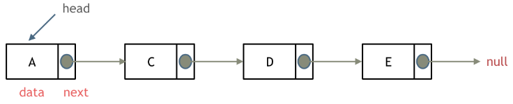

# Day3 链表 Part1

- 链表是通过指针串联的线性结构，每个节点由值和指向下一个节点的指针，最后的节点指向null
- 链表头节点一般被称为head
    
    
    
- 链表的类型包括：
    - 单(向)链表：如上图
    - 双(向)链表：相较于单向链表只能从前向后遍历，双向链表有额外的指针支持从后向前遍历
        
        
        
    - 循环链表：循环链表首尾相连，即最后节点的 next 指针指向 head 节点
        
        
        
- **链表在内存中的分布是随机的。**不同于数组在内存中是连续分布的。
    - 链表通过指针指向的地址链接每个节点
    - 节点分布的位置和机制取决于系统内存管理
- 定义一个链表(单向)
    
    ```cpp
    struct ListNode {
        int val;  // 节点上存储的元素
        ListNode *next;  // 指向下一个节点的指针
        // 构造函数，创建一个值为x，指向null的链表节点
        ListNode(int x) : val(x), next(NULL) {}  
    };
    ```
    
    - C++ 默认提供下面一个构造函数，但不会初始化任何成员变量
        
        ```cpp
        ListNode()
        ```
        
        如果使用上面的构造函数，需要手动初始化节点的值
        
        ```cpp
        ListNode* head = new ListNode();
        head->val = 5;
        ```
        
- 操作链表
    - 删除一个节点
        
        
        
        - 通过将节点 C 的 next 修改为 E，我们就成功在链表中删除了 D 节点
            
            ```cpp
            // assume curr points to C
            ListNode* toDelete = curr->next;
            curr->next = curr->next->next;   // point C's next to E
            delete(toDelete);    // free node D
            ```
            
        - 需要注意的是在 C++ 中，**需要手动 free 掉 new 出来的节点**，否则 D 将造成**内存泄露**
            - 其他语言 如 Python 和 Java 有垃圾回收机制，不需要单独 free
    - 添加一个节点
        
        
        
        - 通过将节点 C 的 next 修改为 F，再将 F 的 next 修改为 D 即可完成链表的插入
            - 需要注意的是应先将 F 的 next 设为 D，再改动 C 的 next。先改动 C->next 将导致丢失节点 D 的地址(D 仍然存在，只是记录丢失)，从而无法设置 F->next
            - 或者通过另一个临时指针先指向 D 的地址，再改动C->next
- 链表的插入和删除操作都需要 *O(1)* 时间，但**主要开销是在定位链表节点**上，需要从链表头依次遍历至想要的位置，因而查找的时间复杂度为 *O(n)*
    - 与数组(Array)相比：
        - 数组在内存连续分布，支持随机访问，查找时间为 *O(1)*，插入删除时间 *O(n)*
        - 链表不连续分布，不支持随机访问，查找时间 *O(n)*，插入删除时间 *O(1)*
        - 数组定义时长度固定，想要改动长度必须重新定义一个新数组
        - 链表长度不固定，可以动态改变，适合频繁增删，较少查询的场景

---

## 203 Remove Linked List Elements

### First Time Code:

```cpp
class Solution {
public:
    ListNode* removeElements(ListNode* head, int val) {
        if(!head)
            return head;
        ListNode* fakeHead = new ListNode(-1);
        fakeHead->next = head;
        ListNode* curr = fakeHead;
        while(curr->next) {
            if(curr->next->val == val)
                curr->next = curr->next->next;
            else
                curr = curr->next;
        }
        return fakeHead->next;
    }
};
```

---

- 虚拟头节点的应用
    - 虚拟头节点在链表中是非常有用的技巧，创造一个存在于 head 节点之前的虚拟节点，允许我们可以向操作其他节点一样操作 head 节点
- 虚拟节点 + 释放内存代码
    
    ```cpp
    class Solution {
    public:
        ListNode* removeElements(ListNode* head, int val) {
            ListNode* fakeHead = new ListNode(-1);
            fakeHead->next = head;
            ListNode* curr = fakeHead;
            while(curr->next) {
                if(curr->next->val == val) {
                    ListNode *tmp = curr->next;
                    curr->next = curr->next->next;
                    delete tmp;
                }
                else
                    curr = curr->next;
            }
            head = fakeHead->next;
            delete fakeHead;
            return head;
        }
    };
    ```
    

## 707 Design Linked List

### First Time Code

```cpp
class MyLinkedList {
public:
    struct ListNode {
        int val;
        ListNode* next;

        ListNode();

        ListNode(int _val, ListNode* _next) {
            val = _val;
            next = _next;
        }
        
        ListNode(int _val) {
            val = _val;
            next = nullptr;
        }
    };

    ListNode* fakeHead;
    int length;

    MyLinkedList() {
        fakeHead = new ListNode(-1);
        length = 0;
    }

    int get(int index) {
        if (index < 0 || index >= length)
            return -1;
        ListNode* curr = fakeHead;
        while (index > 0) {
            curr = curr->next;
            --index;
        }
        return curr->next->val;;
    }

    void addAtHead(int val) {
        ListNode* newNode = new ListNode(val, fakeHead->next);
        fakeHead->next = newNode;
        ++length;
    }

    void addAtTail(int val) {
        ListNode* curr = fakeHead;
        while(curr->next != nullptr) {
            curr = curr->next;
        }
        ListNode* newNode = new ListNode(val);
        curr->next = newNode;
        ++length;
    }

    void addAtIndex(int index, int val) {
        if (index == 0) {
            addAtHead(val);
            return;
        } else if (index == length) {
            addAtTail(val);
            return;
        } else if (index > length)
            return;
        ListNode* curr = fakeHead;
        while (index > 0) {
            curr = curr->next;
            --index;
        }
        ListNode* newNode = new ListNode(val, curr->next);
        curr->next = newNode;
        ++length;
    }

    void deleteAtIndex(int index) {
        if(index >= length || index < 0)
            return;
        ListNode* curr = fakeHead;
        while (index > 0) {
            curr = curr->next;
            --index;
        }
        ListNode* tmp = curr->next;
        curr->next = curr->next->next;
        delete tmp;
        tmp = nullptr;
        --length;
    }
};

/**
 * Your MyLinkedList object will be instantiated and called as such:
 * MyLinkedList* obj = new MyLinkedList();
 * int param_1 = obj->get(index);
 * obj->addAtHead(val);
 * obj->addAtTail(val);
 * obj->addAtIndex(index,val);
 * obj->deleteAtIndex(index);
 */
```

---

- 重点还是在虚拟头节点能很好地帮助操作链表

## 206 Reverse Linked List

### First Time Code

```cpp
/**
 * Definition for singly-linked list.
 * struct ListNode {
 *     int val;
 *     ListNode *next;
 *     ListNode() : val(0), next(nullptr) {}
 *     ListNode(int x) : val(x), next(nullptr) {}
 *     ListNode(int x, ListNode *next) : val(x), next(next) {}
 * };
 */
class Solution {
public:
    ListNode* reverseList(ListNode* head) {
        if(!head || !head->next)
            return head;
        ListNode* prev = nullptr;
        ListNode* curr = head;
        ListNode* next = head->next;

        while(next) {
            curr->next = prev;
            prev = curr;
            curr = next;
            next = next->next;
        }

        curr->next = prev;
        return curr;
    }
};
```

- 通过 prev, curr 和 next 三指针相互配合反转链表

---