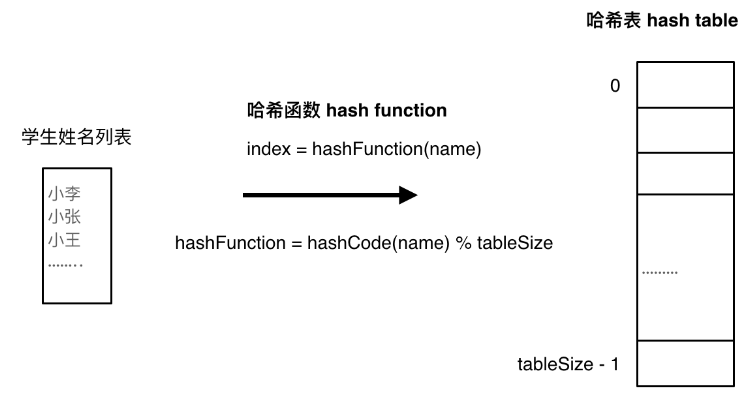

# Day6 哈希 Part1

- 哈希表是一种实现关联数组的数据结构，它实现了键和值的对应
    - *a **hash table**, also known as a **hash map** or a **hash set**, is a data structure that implements an associative array, also called a dictionary, which is an abstract data type that maps keys to values. ([Wikipedia](https://en.wikipedia.org/wiki/Hash_table))*
- 数组其实就是一种哈希表，每个数组的索引是键，数组中对应的内容是值
- 哈希表通过哈希函数 (hash function) 来对应键和值，表的查询时间为 O(1)
- 哈希函数
    - 哈希函数根据特定的规则处理接收到的数据，并返回该数据应该出现的索引位置，如下图
        
        
        
    - 通过 hashCode 处理名字过后返回的数字与哈希表的tableSize取余，得到该名字对应的存储索引位置
    - 当学生的数量大于哈希表的存储容量，或者有两个学生被映射到同一个哈希表位置中时，就发生了 **哈希冲突(碰撞)**
- 解决哈希冲突
    - 哈希冲突发生时机：当两个数据被映射到同一个哈希表的位置时
        
        
        
    - 解决办法：
        - 拉链法：如果小李和小王都被映射到了位置1，我们将发生冲突的元素存储在链表中，这杨小李和小王的数据都能够保留。
            - 缺点：如果该解决冲突的链表太长，那么反而会降低哈希表的表现，因为过长的链表会加长访问数据的时间，基于链表只能遍历
            - 要选择适当的哈希表的大小，这样既不会因为数组空值而浪费大量内存，也不会因为链表太长而在查找上浪费太多时间
        - 线性探测法：依靠哈希表中的空位解决冲突。如果小王被映射到了位置1，但小李已经占据位置1，那么线性探测法会将小王放到下一个可用的空位。
            - 注意：必须要求 tableSize 大于 dataSize
            - 缺点：
                - 在哈希冲突较多时，元素会不断地放入向后的最近可用位置上，重复次数太多，在查找时就会发展为遍历
- 三种哈希结构：数组、集合 (set)、映射 (map)
    
    
    | 集合 | 底层 | 是否有序 | 数值能否重复 | 能否更改数值 | 查询时间 | 增删时间 |
    | --- | --- | --- | --- | --- | --- | --- |
    | std::set | 红黑树 | 是 | 否 | 否 | O(log n) | O(log n) |
    | std::multiset | 红黑树 | 是 | 是 | 否 | O(log n) | O(log n) |
    | std::unordered_set | 哈希表 | 否 | 否 | 否 | O(1) | O(1) |
    
    | 映射 | 底层 | 是否有序 | 数值能否重复 | 能否更改数值 | 查询时间 | 增删时间 |
    | --- | --- | --- | --- | --- | --- | --- |
    | std::map | 红黑树 | key有序 | key不可重复 | key不可修改 | O(log n) | O(log n) |
    | std::multimap | 红黑树 | key有序 | key可重复 | key不可修改 | O(log n) | O(log n) |
    | std::unordered_map | 哈希表 | key无序 | key不可重复 | key不可修改 | O(1) | O(1) |
- 当要使用集合来解决哈希问题的时候，优先使用unordered_set，因为它的查询和增删效率是最优的，如果需要集合是有序的，那么就用set，如果要求不仅有序还要有重复数据的话，那么就用multiset。

---

## 242 Valid Anagram

### First Time Code

```cpp
class Solution {
public:
    bool isAnagram(string s, string t) {
        if(s.length() != t.length())
            return false;
        unordered_map<char, int> count;

        for(int i = 0; i < s.length(); ++i) {
            count[s[i]]++;
        }

        for(int i = 0; i < t.length(); ++i) {
            count[t[i]]--;
            if(count[t[i]] < 0) {
                return false;
            }
        }
        return true;
    }
};
```

- 使用哈希表计算 `s` 中每个字母出现的次数，然后减去 `t` 中出现的次数，如果某个字幕次数下降至0一下，则说明两边字母数量不对等
- 出去哈希表，也可以用容量为26的数组，字母存储在索引 `s[i] - 'a'` 中，因为只包含小写字母

```cpp
class Solution {
public:
    bool isAnagram(string s, string t) {
        if(s.length() != t.length())
            return false;
        int count[26] = {0};

        for(int i=0; i<s.length(); ++i) {
            count[s[i] - 'a']++;
        }

        for(int i=0; i<t.length(); ++i) {
            count[t[i] - 'a']--;
            if(count[t[i] - 'a'] < 0)
                return false;
        }

        return true;
    }
};
```

## 349 Intersection of Two Arrays

### First Time Code

```cpp
class Solution {
public:
    vector<int> intersection(vector<int>& nums1, vector<int>& nums2) {
        unordered_map<int, int> count;
        vector<int> ans;
        for(int i=0; i<nums1.size(); ++i) {
            ++count[nums1[i]];
        }

        for(int i=0; i<nums2.size(); ++i) {
            if(count[nums2[i]] > 0) {
                ans.push_back(nums2[i]);
                count[nums2[i]] = 0;
            }
        }
        return ans;
    }
};
```

---

- 使用 unordered_set 比 unordered_map 更好地存储和管理数组内的元素
    - unordered_set 自动去重 (无法插入重复元素)
- C++新特性还需要记得使用，新方法初始化 set 和vector
    - `unordered_set<int> num_set(nums1.begin(), nums1.end());`
    - `vector<int>(result.begin(), result.end());`
- 代码
    
    ```cpp
    class Solution {
    public:
        vector<int> intersection(vector<int>& nums1, vector<int>& nums2) {
            unordered_set<int> result;
            unordered_set<int> num_set(nums1.begin(), nums1.end());
    
            for(int num : nums2) {
                if(num_set.find(num) != num_set.end()) {
                    result.insert(num);
                }
            }
            return vector<int>(result.begin(), result.end());
        }
    };
    ```
    

## 202 Happy Number

### First Time Code

```cpp
class Solution {
public:
    bool isHappy(int n) {
        if(n == 1)
            return true;
        else if(n <= 3)
            return false;        
        unordered_set<int> appear;
        while(true) {
            int tmp = 0;
            while(n >= 10) {
                int digit = n % 10;
                n /= 10;
                tmp += digit * digit;
            }
            tmp += n * n;
            if(tmp == 1)
                return true;
            else if(appear.find(tmp) != appear.end())
                return false;
            else {
                appear.insert(tmp);
                n = tmp;
            }
        }
    }
};
```

---

- 利用 set 去重的性质，当有重复元素出现时，证明我们陷入了循环

## 1 Two Sum

### First Time Code

```cpp
class Solution {
public:
    vector<int> twoSum(vector<int>& nums, int target) {
        unordered_map<int, int> map;
        vector<int> ans(2);
        for(int i=0; i<nums.size(); ++i) {
            if(map[nums[i]] != 0) {
                ans[0] = i;
                ans[1] = map[nums[i]] - 1;
                break;
            }
            map[target-nums[i]] = i + 1;
        }
        return ans;
    }
};
```